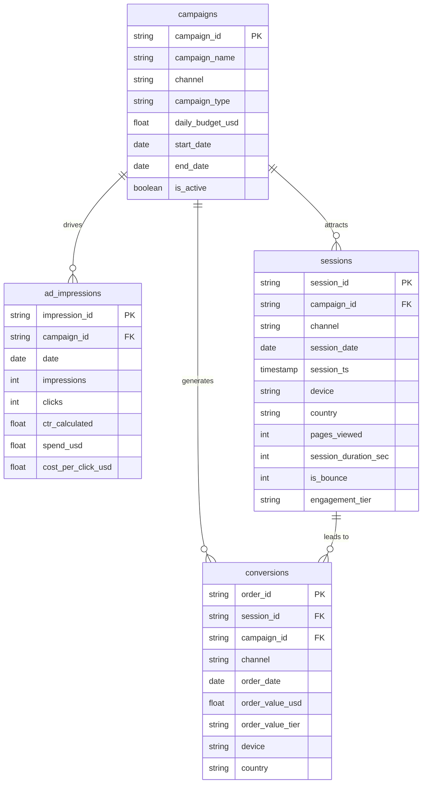

[](README.zh-TW.md)
&nbsp;&nbsp;
[](README.zh-CN.md)


# Traffic Sources & Ad ROI Analysis

**Python · Google BigQuery · SQL · Power BI**

---

## Project Overview

This project analyses the advertising effectiveness and return on investment (ROI) across five traffic channels — Google Ads, Facebook Ads, Email, Organic, and Direct. Simulated data for the full year of 2024 was generated using Python (Faker), loaded into **Google BigQuery** for ETL cleaning and multi-dimensional analysis, and visualised in a three-page interactive **Power BI** dashboard.

The goal is to provide data-driven support for **channel budget allocation, campaign optimisation, and ROI improvement strategies** through structured data modelling and visual analytics.

### Scope

- Generate reproducible simulated data using **Python (pandas, NumPy, Faker)** with `seed=42`
- Execute a full ETL cleaning pipeline in **BigQuery** (NULL checks, deduplication, field standardisation, derived fields)
- Build a star schema data model (`campaigns` → `ad_impressions` / `sessions` / `conversions`)
- Create 5 sets of analytical SQL Views (traffic analysis, CTR vs CVR, ROI ranking)
- Build a 3-page interactive dashboard in **Power BI**
- Business insights and actionable recommendations

---

### Why Simulated Data?

Real advertising performance data — including campaign spend, impressions, clicks, and conversion events — is commercially sensitive and subject to strict confidentiality at most organisations. Publicly available ad datasets are either heavily aggregated (no session or conversion row-level detail), platform-restricted (Facebook Ads Manager, Google Ads API access), or limited to a single channel without cross-channel comparability.

This project uses Python-generated simulated data for the following reasons:

- **Full pipeline control**: Simulating data allows the project to cover the complete analytics workflow end-to-end — from raw event generation through ETL, data modelling, SQL Views, and dashboarding — without being constrained by what a public dataset happens to expose.
- **Realistic business scenario**: Baseline parameters (CTR, CVR, average order value, seasonality) are grounded in published digital marketing benchmarks (e.g. Google Ads industry averages: CTR 4–6%; Email marketing CVR 3–6%; Q4 seasonal lift: +20–30%). The simulated patterns closely reflect real-world behaviour, including Email's low-spend / high-ROAS profile and Display's typically high CPA.
- **Reproducibility and auditability**: Using `random.seed(42)` ensures that every analyst can regenerate the exact same dataset and validate all SQL outputs, which is a requirement for portfolio work reviewed by technical hiring managers.
- **Cross-channel comparability**: Constructing data across five channels (Google Ads, Facebook Ads, Email, Organic, Direct) with consistent schemas enables cross-channel ROI analysis that would be extremely difficult to assemble from real fragmented data sources.

> **Note:** The simulation parameters (CTR, CVR, order values, Q4 seasonality multiplier) are documented in the [Simulation Parameters](#simulation-parameters) section and fully specified in [`docs/data_dictionary.md`](./docs/data_dictionary.md). All analytical findings are interpreted in the context of the simulated scenario.
---

## Dataset

| Item | Description |
|---|---|
| Source | Python simulated data (`random.seed(42)` — fully reproducible) |
| Row Counts | campaigns: 12 rows / ad_impressions: 3,720 rows / sessions: 511,797 rows / conversions: 18,288 rows |
| Time Range | Full year 2024 (2024-01-01 to 2024-12-31) |
| Channels | Google Ads, Facebook Ads, Email, Organic, Direct (12 campaigns total) |
| Key Fields | campaign_id, channel, campaign_type, daily_budget, impressions, clicks, CTR, spend_usd, session_id, device, country, order_value_usd |

---

## Tools & Technologies

| Tool | Purpose |
|---|---|
| Python (pandas, NumPy, Faker) | Simulated data generation & BigQuery upload |
| Google BigQuery (Standard SQL) | Data warehouse, ETL cleaning, analytical Views |
| Power BI | Interactive dashboards & KPI visualisation |
| GitHub | Version control & documentation |

---

## 1. Data Generation & Cleaning

### Data Generation (`01_generate_data.py`)

- Uses `random.seed(42)` to ensure full reproducibility
- Generates 4 raw tables: `campaigns`, `ad_impressions`, `sessions`, `conversions`
- Sets baseline CTR / CVR / average order value per channel, with a seasonality multiplier (Q4 +30%)
- Paid channels (Google Ads, Facebook Ads, Email) generate impressions, clicks, and spend; Organic / Direct generate sessions only

### ETL Cleaning (`01_data_cleaning.sql` — BigQuery Standard SQL)

**Step 1 — Data Validation Checks**

| Check | Description |
|---|---|
| NULL / blank primary keys | NULL and empty-string check on PK columns across all 4 tables |
| Duplicate primary keys | `GROUP BY PK HAVING COUNT > 1` to enforce uniqueness |
| Referential integrity | Verify that `campaign_id` in ad_impressions, sessions, and conversions exists in the campaigns table |
| Numeric range | Check for negative impressions/clicks/spend, CTR outside [0,1], invalid bounce flag |
| Date logic | Confirm `end_date` ≥ `start_date` |

**Step 2 — Clean & Standardise → Write to `traffic_ad_roi_clean.*`**

| Cleaning Operation | Description |
|---|---|
| Deduplication | `ROW_NUMBER() OVER (PARTITION BY pk)` — keep the most recent record |
| Channel standardisation | `CASE UPPER(TRIM(channel))` — unify casing (e.g. `"GOOGLE"` → `"Google Ads"`) |
| Numeric correction | `GREATEST(COALESCE(value, 0), 0)` — fill NULLs with 0 and correct negatives |
| CTR recalculation | Recomputed from raw clicks/impressions, more reliable than the stored value |
| Derived field — engagement_tier | Classified as High / Medium / Low based on session duration and pages viewed |
| Derived field — order_value_tier | High Value (≥$500) / Mid Value (≥$100) / Low Value, based on order amount |
| Invalid order filtering | Remove records where `order_value_usd` ≤ 0 |

---

## 2. Data Model (BigQuery — Star Schema)

This project uses `campaigns` as the central dimension table, with `ad_impressions`, `sessions`, and `conversions` as fact tables, forming a clean star schema.

### Schema Diagram



### Table Descriptions

| Table | Description | Design Notes |
|---|---|---|
| `campaigns` | Master record for 12 ad campaigns | Covers channel, type, daily budget, and flight dates; derives `is_active` field |
| `ad_impressions` | Daily impressions & clicks for paid channels (3,720 rows) | CTR recalculated from raw counts; derives `cost_per_click_usd` |
| `sessions` | Website session records (511,797 rows) | Includes device, country, engagement depth; derives `engagement_tier` |
| `conversions` | Order conversion events (18,288 rows) | Dual FK (session + campaign); derives `order_value_tier`; invalid orders removed |

---

## 3. SQL Analysis

### Analytical Views Architecture

| SQL File | Views Created | Description |
|---|---|---|
| `01_data_cleaning.sql` | `traffic_ad_roi_clean.*` (4 tables) | NULL checks, deduplication, field standardisation, engagement_tier, order_value_tier |
| `02_traffic_analysis.sql` | `v_channel_performance`, `v_monthly_channel_trend`, `v_device_channel_conversion` | Overall channel performance, monthly trends, device-level conversion breakdown |
| `03_ctr_conversion.sql` | `v_campaign_daily_ctr_cvr`, `v_ctr_bucket_analysis`, `v_campaign_ctr_cvr_scatter` | Daily CTR vs CVR, bucket analysis, scatter plot data |
| `04_roi_analysis.sql` | `v_campaign_roi`, `v_monthly_roi_trend`, `v_campaign_type_roi` | Campaign ROI ranking, monthly ROI trends, campaign type comparison |
| `05_dim_channel.sql` | `dim_channel`, `dim_campaign_type` | Channel & campaign type dimension tables (with sort order) |

### Key Business Questions

**Which traffic channels drive the most orders and highest revenue?**

```sql
SELECT
    channel,
    COUNT(order_id)               AS total_orders,
    ROUND(SUM(order_value_usd),0) AS total_revenue_usd,
    ROUND(AVG(order_value_usd),2) AS avg_order_value
FROM `traffic_ad_roi_clean.conversions`
GROUP BY channel
ORDER BY total_revenue_usd DESC;
```

**ROAS and net ROI ranking by campaign (paid channels only)?**

```sql
SELECT
    c.campaign_id,
    c.campaign_name,
    c.channel,
    ROUND(SUM(i.spend_usd), 0)                                    AS total_spend,
    ROUND(SUM(v.order_value_usd), 0)                              AS total_revenue,
    ROUND(SAFE_DIVIDE(SUM(v.order_value_usd), SUM(i.spend_usd)), 2) AS roas,
    ROUND(SAFE_DIVIDE(SUM(v.order_value_usd) - SUM(i.spend_usd),
                      SUM(i.spend_usd)) * 100, 1)                 AS roi_pct
FROM `traffic_ad_roi_clean.campaigns`      c
JOIN `traffic_ad_roi_clean.ad_impressions` i ON i.campaign_id = c.campaign_id
JOIN `traffic_ad_roi_clean.conversions`    v ON v.campaign_id = c.campaign_id
WHERE c.channel NOT IN ('Organic', 'Direct')
GROUP BY 1, 2, 3
ORDER BY roas DESC;
```

**CTR bucket analysis — does higher CTR actually lead to higher CVR?**

```sql
SELECT
    CASE
        WHEN ctr_calculated < 0.01 THEN '< 1%'
        WHEN ctr_calculated < 0.02 THEN '1–2%'
        WHEN ctr_calculated < 0.03 THEN '2–3%'
        WHEN ctr_calculated < 0.04 THEN '3–4%'
        WHEN ctr_calculated < 0.05 THEN '4–5%'
        ELSE '≥ 5%'
    END                                          AS ctr_bucket,
    COUNT(DISTINCT i.impression_id)              AS campaign_days,
    ROUND(AVG(i.ctr_calculated) * 100, 2)        AS avg_ctr_pct,
    ROUND(SAFE_DIVIDE(
        COUNT(v.order_id),
        COUNT(DISTINCT s.session_id)
    ) * 100, 2)                                  AS cvr_pct
FROM `traffic_ad_roi_clean.ad_impressions` i
LEFT JOIN `traffic_ad_roi_clean.sessions`    s ON s.campaign_id = i.campaign_id
                                               AND s.session_date = i.date
LEFT JOIN `traffic_ad_roi_clean.conversions` v ON v.session_id = s.session_id
GROUP BY ctr_bucket
ORDER BY avg_ctr_pct;
```

---

## 4. Power BI Dashboard (3 Pages)

### Page 1: Channel Overview


- **KPI Cards**: Total orders (18,288), total revenue ($1,754,574), total ad spend, overall ROAS
- **Channel Order Ranking**: Google Ads leads with 11,732 orders; Email contributes 6.6% of orders at the lowest spend
- **Revenue vs Spend Bar Chart**: Side-by-side comparison of revenue and spend per channel, visually highlighting ROI gaps
- **Monthly Trend Line Chart**: Full-year 2024 order trends by channel, with a clear Q4 peak-season effect
- **Device Donut Chart**: Conversion share breakdown by Desktop / Mobile / Tablet

### Page 2: CTR vs Conversion


- **CTR × CVR Scatter Plot**: Campaign-level bubbles sized by order volume, revealing that "High CTR ≠ High CVR"
- **Campaign Detail Table**: CTR, CVR, order count, and average order value per campaign
- **Daily CTR & CVR Line-Bar Chart**: Day-level trends to observe performance fluctuations throughout a campaign's flight

### Page 3: ROI Analysis


- **Campaign ROI Ranking Bar Chart**: From Email_Abandoned_Cart (ROAS 45.12x) to Google_Display_Remarketing (ROAS 0.70x)
- **ROAS vs Spend Scatter Plot**: Higher spend does not equal higher ROAS — Email achieves the highest return at minimal cost
- **Campaign Type Matrix**: Automation > Newsletter > Promotion > Search > Shopping > Display
- **Monthly ROI Trend**: Full-year ROI trend comparison across campaign types

Dashboard PDF export: [`powerbi/dashboard.pdf`](./powerbi/dashboard.pdf)  
See details: [`powerbi/dashboard_design.md`](./powerbi/dashboard_design.md)

---

## Key Findings

### Channel Performance

| Channel | Orders | Total Revenue (USD) | CVR | ROAS |
|---------|--------|---------------------|-----|------|
| Google Ads | 11,732 | $1,118,727 | 3.54% | 2.15x |
| Facebook Ads | 2,797 | $246,650 | 2.65% | 1.38x |
| Direct | 1,979 | $215,525 | 6.83% | N/A |
| Email | 1,215 | $125,891 | **7.43%** | **30.8x** |
| Organic | 565 | $47,781 | 1.93% | N/A |

### Campaign ROI Ranking (Paid Channels)

| Rank | Campaign | ROAS | ROI% | CPA (USD) |
|------|----------|------|------|-----------|
| 🥇 1 | Email_Abandoned_Cart | 45.12x | 4,412% | $2.27 |
| 🥈 2 | Email_Newsletter_Monthly | 27.86x | 2,686% | $3.74 |
| 🥉 3 | Email_Promo_Flash_Sale | 26.95x | 2,595% | $3.85 |
| 4 | Google_Shopping_Q1 | 3.54x | 254% | $26.98 |
| 5 | Facebook_Retargeting | 2.63x | 163% | $33.77 |
| ... | ... | ... | ... | ... |
| 🚨 Last | Google_Display_Remarketing | 0.70x | **-30%** | $132.36 |

### CTR vs CVR Insight

When filtered to the Email channel, the CTR 3–4% bucket yields the highest CVR (5.22%), while CTR ≥ 5% actually produces the lowest CVR (3.47%). **High CTR ≠ High CVR** — ad appeal and purchase intent must be evaluated separately.

---

## Business Recommendations

1. **Scale up Email Automation investment** — Email_Abandoned_Cart (ROAS 45.12x, CPA $2.27) is the most efficient campaign across all channels; prioritise expanding trigger frequency and audience reach
2. **Pause or restructure Google Display Remarketing** — ROAS of only 0.70x makes it the sole negative-ROI campaign (-30%), with a CPA of $132; recommend pausing and revisiting audience segmentation and bidding strategy
3. **Replace CTR with ROAS / CPA as the primary optimisation metric** — analysis shows high CTR does not guarantee high CVR; shift optimisation focus from click-through rate to conversion rate and cost per order
4. **Concentrate Google Ads budget on Search and Shopping** — Google_Brand_Search and Google_Shopping_Q1 achieve ROAS of 3x+ and 3.5x respectively; Display significantly underperforms and budget should be reallocated to high-efficiency campaign types
5. **Plan promotional campaigns ahead of the Q4 peak season** — monthly trends show a significant lift in conversions from October to December; aim to finalise Email automation sequences and Google Shopping creatives before the end of September

---

## Project Structure
```
03_Traffic_Sources_Ad_ROI_Analysis/
├── README.md
├── data/
│ ├── bigquery_cache_limit50/ # BigQuery Views cache (first 50 rows, for offline reference)
│ └── .gitkeep # Raw CSVs (gitignored — large files not committed)
├── scripts/
│ ├── 01_generate_data.py # Simulated data generation (seed=42, reproducible)
│ └── 02_upload_to_bigquery.py # BigQuery upload (traffic_ad_roi dataset)
├── sql/
│ ├── 01_data_cleaning.sql # ETL cleaning & validation
│ ├── 02_traffic_analysis.sql # Traffic source analysis
│ ├── 03_ctr_conversion.sql # CTR vs conversion rate analysis
│ ├── 04_roi_analysis.sql # ROI & ROAS analysis
│ ├── 05_dim_channel.sql # Dimension tables (channel & campaign type)
│ └── screenshots/ # SQL result screenshots
├── powerbi/
│ ├── dashboard.pdf # Dashboard PDF export
│ ├── dashboard_design.md # Power BI design doc (visual specs & DAX)
│ ├── background.png # Dashboard background image
│ └── screenshots/ # Dashboard screenshots
├── docs/
│ └── data_dictionary.md # Data dictionary (field descriptions, metric definitions, simulation parameters)
├── error_reports/ # ETL error reports
└── log.ipynb # Development log notebook

```


---

## How to Reproduce

**Prerequisites**: Python 3.8+, Google Cloud account (BigQuery enabled), Power BI Desktop

1. Install dependencies
   ```bash
   pip install pandas numpy faker google-cloud-bigquery pyarrow
   ```
2. Generate simulated data
   ```bash
   python scripts/01_generate_data.py
   # Output: data/campaigns.csv, ad_impressions.csv, sessions.csv, conversions.csv
   ```
3. Upload data to BigQuery
   ```bash
   python scripts/02_upload_to_bigquery.py
   # Target: {project}.traffic_ad_roi.*
   ```
4. Run SQL scripts in BigQuery in order (01 → 05)
5. Open `.pbix` in Power BI Desktop and connect to BigQuery Views

---

## Simulation Parameters

| Channel | Baseline CTR | Baseline CVR | Avg. Order Value |
|---------|-------------|-------------|-----------------|
| Google Ads | 4.5% | 3.5% | $95 |
| Facebook Ads | 2.2% | 2.5% | $88 |
| Email | 2.8% | 5.5% | $102 |
| Organic | N/A | 3.0% | $85 |
| Direct | N/A | 4.5% | $110 |

> Data is fixed with `random.seed(42)` and fully reproducible. See [`docs/data_dictionary.md`](./docs/data_dictionary.md) for detailed field definitions.

---

## Author

Ross Tang | [GitHub](https://github.com/ross-bi)

## License

This project is licensed under the [MIT License](./LICENSE).
