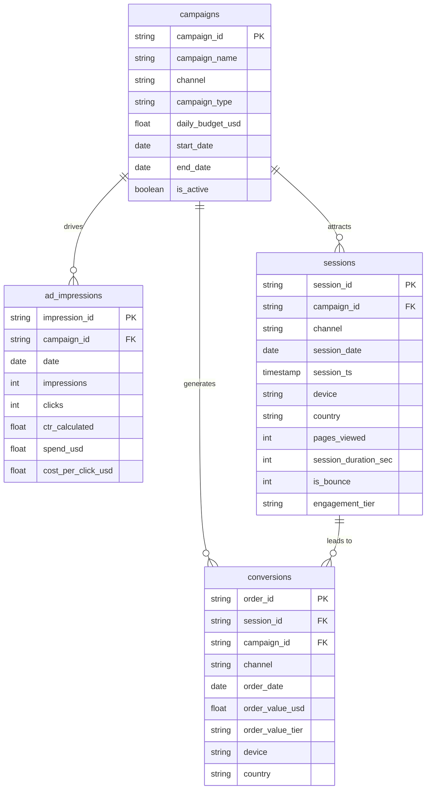
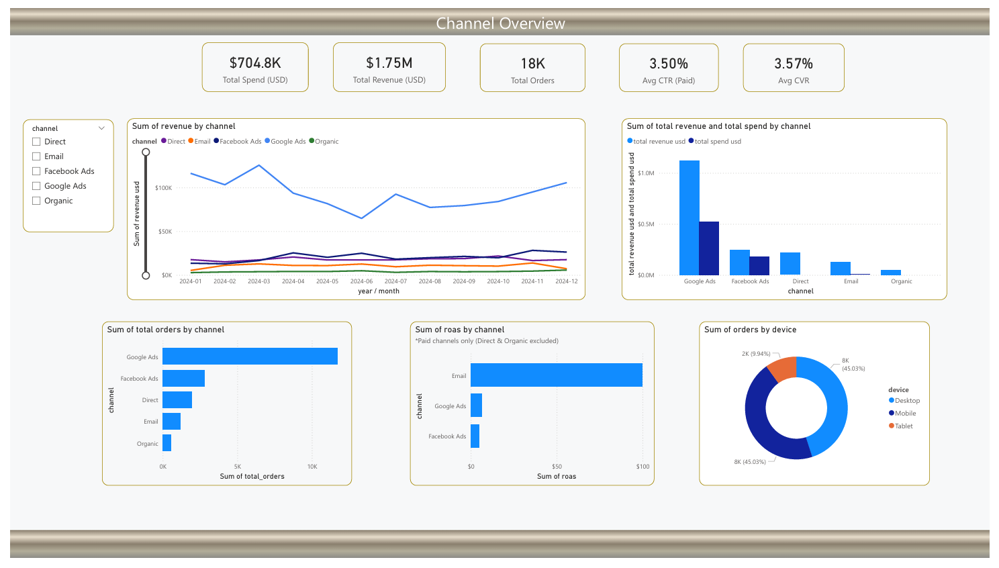
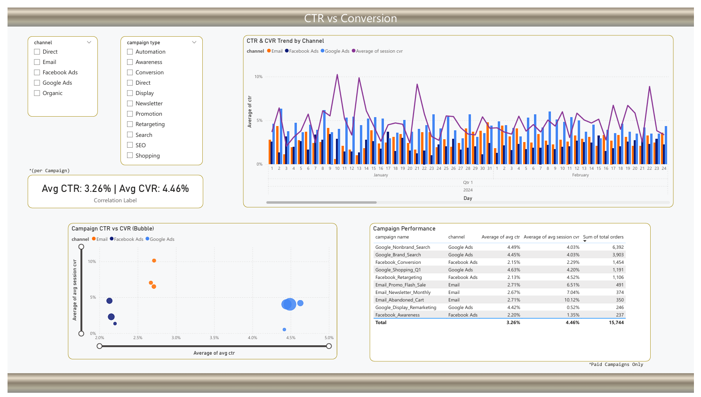
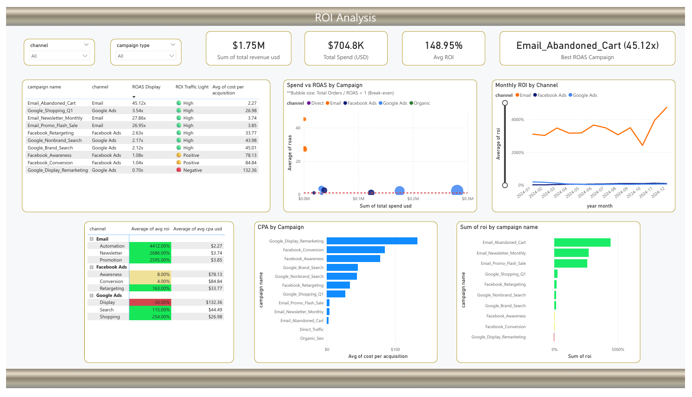

[](README.md)
&nbsp;&nbsp;
[](README.zh-TW.md)

# 流量来源与广告 ROI 分析

**Python · Google BigQuery · SQL · Power BI**

---

## 专案概述

本项目分析五大流量渠道（Google Ads、Facebook Ads、Email、Organic、Direct）的广告效益与投资报酬率（ROI）。透过 Python（Faker）生成 2024 全年仿真数据，加载 **Google BigQuery** 进行 ETL 清洗与多维分析，并以 **Power BI** 呈现三页交互式仪表板。

目标是透过结构化数据建模与可视化分析，为**渠道预算分配、广告活动优化及 ROI 提升策略**提供数据支持。

### 涵盖范畴

- 使用 **Python（pandas、NumPy、Faker）** 生成可重现的仿真数据（seed=42）
- 在 **BigQuery** 执行完整 ETL 清洗流程（NULL 检查、去重、字段标准化、衍生字段）
- 建立星型纲要数据模型（campaigns → ad_impressions / sessions / conversions）
- 建立 5 组分析 SQL Views（使用分析、CTR vs CVR、ROI 排名）
- 在 **Power BI** 中建立 3 页交互式仪表板
- 业务洞察与可行建议

---

## 数据集

| 项目 | 说明 |
|---|---|
| 来源 | Python 模拟生成（`random.seed(42)`，结果可完全重现） |
| 资料笔数 | campaigns: 12 rows / ad_impressions: 3,720 rows / sessions: 511,797 rows / conversions: 18,288 rows |
| 时间范围 | 2024 年全年（2024-01-01 至 2024-12-31） |
| 涵盖渠道 | Google Ads、Facebook Ads、Email、Organic、Direct（共 12 支 Campaign） |
| 主要字段 | campaign_id、channel、campaign_type、daily_budget、impressions、clicks、CTR、spend_usd、session_id、device、country、order_value_usd |

---

## 工具与技术

| 工具 | 用途 |
|---|---|
| Python（pandas、NumPy、Faker） | 仿真数据生成与 BigQuery 上传 |
| Google BigQuery（Standard SQL） | 资料仓储、ETL 清洗、分析 Views |
| Power BI | 交互式仪表板与 KPI 可视化 |
| GitHub | 版本控制与文件记录 |

---

## 一、资料生成与清理

### 资料生成（`01_generate_data.py`）

- 以 `random.seed(42)` 确保可重现性
- 生成 4 张原始表：`campaigns`、`ad_impressions`、`sessions`、`conversions`
- 依渠道设定基准 CTR / CVR / 平均客单价，并加入季节性乘数（Q4 +30%）
- 付费渠道（Google Ads、Facebook Ads、Email）生成曝光、点击、花费；Organic / Direct 仅生成 Session

### ETL 清洗（`01_data_cleaning.sql` — BigQuery Standard SQL）

**Step 1 — 数据验证检查**

| 检查项目 | 说明 |
|---|---|
| NULL / 空白主键 | 对 4 张表的 PK 字段进行 NULL 及空白检查 |
| 重复主键 | GROUP BY PK HAVING COUNT > 1，确保唯一性 |
| 参照完整性 | 验证 ad_impressions、sessions、conversions 的 campaign_id 均存在于 campaigns 表 |
| 数值范围 | 检查负数 impressions/clicks/spend、CTR 超出 [0,1]、无效 bounce flag |
| 日期逻辑 | 确认 end_date ≥ start_date |

**Step 2 — 清理与标准化 → 写入 `traffic_ad_roi_clean.*`**

| 清理操作 | 说明 |
|---|---|
| 去重 | `ROW_NUMBER() OVER (PARTITION BY pk)` 保留最新记录 |
| 渠道标准化 | CASE UPPER(TRIM(channel))，统一大小写格式（如 "GOOGLE" → "Google Ads"） |
| 数值修正 | `GREATEST(COALESCE(value, 0), 0)` 将 NULL 补 0 并修正负值 |
| CTR 重算 | 从原始 clicks/impressions 重新计算，比储存值更可靠 |
| 衍生字段 — engagement_tier | 依 session 时长与浏览页数分为 High / Medium / Low |
| 衍生字段 — order_value_tier | 依订单金额分为 High Value（≥$500）/ Mid Value（≥$100）/ Low Value |
| 无效订单过滤 | 移除 order_value_usd ≤ 0 的转换纪录 |

---

## 二、数据模型（BigQuery — 星型纲要）

本项目以 `campaigns` 为中央维度表，`ad_impressions`、`sessions`、`conversions` 为事实表，构建清晰的星型纲要。

### 纲要图



### 数据表说明

| 表格 | 说明 | 设计重点 |
|---|---|---|
| `campaigns` | 12 支广告活动主档 | 涵盖渠道、类型、每日预算、投放期间；衍生 `is_active` 字段 |
| `ad_impressions` | 付费渠道每日曝光与点击（3,720 rows） | 从原始数值重新计算 CTR；衍生 `cost_per_click_usd` |
| `sessions` | 网站 Session 浏览纪录（511,797 rows） | 含装置、国家、互动深度；衍生 `engagement_tier` |
| `conversions` | 订单转换事件（18,288 rows） | 双向 FK（session + campaign）；衍生 `order_value_tier`；移除无效订单 |

---

## 三、SQL 分析

### 分析 Views 架构

| SQL 档案 | 建立的 Views | 说明 |
|---|---|---|
| `01_data_cleaning.sql` | `traffic_ad_roi_clean.*`（4 tables） | NULL 检查、去重、字段标准化、engagement_tier、order_value_tier |
| `02_traffic_analysis.sql` | `v_channel_performance`、`v_monthly_channel_trend`、`v_device_channel_conversion` | 各渠道整体表现、月度趋势、装置转换分布 |
| `03_ctr_conversion.sql` | `v_campaign_daily_ctr_cvr`、`v_ctr_bucket_analysis`、`v_campaign_ctr_cvr_scatter` | CTR vs CVR 日级别、分桶分析、散点图资料 |
| `04_roi_analysis.sql` | `v_campaign_roi`、`v_monthly_roi_trend`、`v_campaign_type_roi` | Campaign ROI 排名、月度 ROI 趋势、Campaign Type 比较 |
| `05_dim_channel.sql` | `dim_channel`、`dim_campaign_type` | 渠道 & Campaign Type 维度表（含排序） |

### 主要商业问题

**哪些流量渠道带来最多订单与最高收益？**

```sql
SELECT
    channel,
    COUNT(order_id)               AS total_orders,
    ROUND(SUM(order_value_usd),0) AS total_revenue_usd,
    ROUND(AVG(order_value_usd),2) AS avg_order_value
FROM `traffic_ad_roi_clean.conversions`
GROUP BY channel
ORDER BY total_revenue_usd DESC;
```

**各 Campaign 的 ROAS 与净 ROI 排名（付费渠道）？**

```sql
SELECT
    c.campaign_id,
    c.campaign_name,
    c.channel,
    ROUND(SUM(i.spend_usd), 0)                                    AS total_spend,
    ROUND(SUM(v.order_value_usd), 0)                              AS total_revenue,
    ROUND(SAFE_DIVIDE(SUM(v.order_value_usd), SUM(i.spend_usd)), 2) AS roas,
    ROUND(SAFE_DIVIDE(SUM(v.order_value_usd) - SUM(i.spend_usd),
                      SUM(i.spend_usd)) * 100, 1)                 AS roi_pct
FROM `traffic_ad_roi_clean.campaigns`      c
JOIN `traffic_ad_roi_clean.ad_impressions` i ON i.campaign_id = c.campaign_id
JOIN `traffic_ad_roi_clean.conversions`    v ON v.campaign_id = c.campaign_id
WHERE c.channel NOT IN ('Organic', 'Direct')
GROUP BY 1, 2, 3
ORDER BY roas DESC;
```

**CTR 分桶分析 — 高 CTR 是否真的带来更高 CVR？**

```sql
SELECT
    CASE
        WHEN ctr_calculated < 0.01 THEN '< 1%'
        WHEN ctr_calculated < 0.02 THEN '1–2%'
        WHEN ctr_calculated < 0.03 THEN '2–3%'
        WHEN ctr_calculated < 0.04 THEN '3–4%'
        WHEN ctr_calculated < 0.05 THEN '4–5%'
        ELSE '≥ 5%'
    END                                          AS ctr_bucket,
    COUNT(DISTINCT i.impression_id)              AS campaign_days,
    ROUND(AVG(i.ctr_calculated) * 100, 2)        AS avg_ctr_pct,
    ROUND(SAFE_DIVIDE(
        COUNT(v.order_id),
        COUNT(DISTINCT s.session_id)
    ) * 100, 2)                                  AS cvr_pct
FROM `traffic_ad_roi_clean.ad_impressions` i
LEFT JOIN `traffic_ad_roi_clean.sessions`    s ON s.campaign_id = i.campaign_id
                                               AND s.session_date = i.date
LEFT JOIN `traffic_ad_roi_clean.conversions` v ON v.session_id = s.session_id
GROUP BY ctr_bucket
ORDER BY avg_ctr_pct;
```

---

## 四、Power BI 仪表板（3 页）

### 第 1 页：Channel Overview（渠道总览）


- **KPI 卡片**：总订单数（18,288）、总收益（$1,754,574）、总广告花费、整体 ROAS
- **渠道订单排名**：Google Ads（11,732）领先，Email 以最低花费贡献 6.6% 订单
- **收益 vs 花费条形图**：各渠道收益与支出对比，直观呈现 ROI 差距
- **月度趋势折线图**：2024 年全年各渠道订单走势，Q4 明显旺季效应
- **装置 Donut 图**：Desktop / Mobile / Tablet 转换占比分布

### 第 2 页：CTR vs Conversion（点击率 vs 转换率）


- **CTR × CVR 散点图**：以 Campaign 为单位，气泡大小代表订单量，揭示「高 CTR ≠ 高 CVR」
- **Campaign 详细表格**：列出各 Campaign 的 CTR、CVR、订单数、平均客单价
- **每日 CTR & CVR 折线柱状图**：日级别趋势，观察 Campaign 投放期间的效益波动

### 第 3 页：ROI Analysis（ROI 分析）


- **Campaign ROI 排名条形图**：Email_Abandoned_Cart（ROAS 45.12x）至 Google_Display_Remarketing（ROAS 0.70x）
- **ROAS vs Spend 散点图**：花费越多不等于 ROAS 越高，Email 以极低花费创最高报酬
- **Campaign Type 矩阵**：Automation > Newsletter > Promotion > Search > Shopping > Display
- **月度 ROI 趋势**：各类型 Campaign ROI 全年走势对比

Dashboard PDF 汇出：[`powerbi/dashboard.pdf`](./powerbi/dashboard.pdf)

---

## 主要发现

### 渠道效益

| 渠道 | 订单数 | 总收益 (USD) | CVR | ROAS |
|------|--------|-------------|-----|------|
| Google Ads | 11,732 | $1,118,727 | 3.54% | 2.15x |
| Facebook Ads | 2,797 | $246,650 | 2.65% | 1.38x |
| Direct | 1,979 | $215,525 | 6.83% | N/A |
| Email | 1,215 | $125,891 | **7.43%** | **30.8x** |
| Organic | 565 | $47,781 | 1.93% | N/A |

### Campaign ROI 排名（付费渠道）

| 排名 | Campaign | ROAS | ROI% | CPA (USD) |
|------|---------|------|------|-----------| 
| 🥇 1 | Email_Abandoned_Cart | 45.12x | 4,412% | $2.27 |
| 🥈 2 | Email_Newsletter_Monthly | 27.86x | 2,686% | $3.74 |
| 🥉 3 | Email_Promo_Flash_Sale | 26.95x | 2,595% | $3.85 |
| 4 | Google_Shopping_Q1 | 3.54x | 254% | $26.98 |
| 5 | Facebook_Retargeting | 2.63x | 163% | $33.77 |
| ... | ... | ... | ... | ... |
| 🚨 Last | Google_Display_Remarketing | 0.70x | **-30%** | $132.36 |

### CTR vs CVR 洞察

在 Email 渠道筛选下，CTR 3–4% 区间的 CVR 最高（5.22%），而 CTR ≥ 5% 的 CVR 反而最低（3.47%）。**高 CTR ≠ 高 CVR**，广告吸引力与购买意图需分开评估。

---

## 业务建议

1. **扩大 Email Automation 投入** — Email_Abandoned_Cart（ROAS 45.12x、CPA $2.27）是全渠道中最高效的 Campaign，应优先加大触发频率与受众覆盖
2. **暂停或重组 Google Display Remarketing** — ROAS 仅 0.70x，为唯一负 ROI Campaign（-30%），每次获客成本高达 $132；建议暂停并重新审视受众分组与出价策略
3. **以 ROAS / CPA 取代纯 CTR 作为优化指针** — 分析显示高 CTR 不等于高 CVR；应将优化重心从点击率转移至转换率与每订单成本
4. **Google Ads 集中预算至 Search 与 Shopping** — Google_Brand_Search 和 Google_Shopping_Q1 的 ROAS 分别达 3x+ 及 3.5x；相比之下 Display 效益远逊，预算应向高效类型倾斜
5. **利用 Q4 旺季效应提前规划促销 Campaign** — 月度趋势显示 10–12 月转换量显著上升；建议于 9 月底前完成 Email 自动化序列与 Google Shopping 广告素材更新

---

## 项目结构
```
03_Traffic_Sources_Ad_ROI_Analysis/
├── README.md
├── data/
│ ├── bigquery_cache_limit50/ # BigQuery Views 快取（前 50 笔，供脱机参考）
│ └── .gitkeep # 原始 CSV（gitignore，不上传大档）
├── scripts/
│ ├── 01_generate_data.py # 仿真数据生成（seed=42，可重现）
│ └── 02_upload_to_bigquery.py # BigQuery 上传（traffic_ad_roi dataset）
├── sql/
│ ├── 01_data_cleaning.sql # ETL 清洗 & 验证
│ ├── 02_traffic_analysis.sql # 流量来源分析
│ ├── 03_ctr_conversion.sql # CTR vs 转换率分析
│ ├── 04_roi_analysis.sql # ROI & ROAS 分析
│ ├── 05_dim_channel.sql # 维度表（channel & campaign type）
│ └── screenshots/ # SQL 执行结果截图
├── powerbi/
│ ├── dashboard.pdf # Dashboard PDF 汇出
│ ├── dashboard_design.md # Power BI 设计文件（可视化规格 & DAX）
│ ├── background.png # Dashboard 背景图
│ └── screenshots/ # Dashboard 截图
├── docs/
│ └── data_dictionary.md # 数据字典（字段说明、指针定义、Simulation Parameters）
├── error_reports/ # ETL 错误报告
└── log.ipynb # 开发日志 Notebook
```

---

## 如何重现本项目

**前置需求**：Python 3.8+、Google Cloud 账号（BigQuery 启用）、Power BI Desktop

1. 安装依赖套件
   ```bash
   pip install pandas numpy faker google-cloud-bigquery pyarrow
   ```
2. 生成仿真数据
   ```bash
   python scripts/01_generate_data.py
   # 输出：data/campaigns.csv, ad_impressions.csv, sessions.csv, conversions.csv
   ```
3. 上传资料至 BigQuery
   ```bash
   python scripts/02_upload_to_bigquery.py
   # 目标：{project}.traffic_ad_roi.*
   ```
4. 依序在 BigQuery 执行 SQL 脚本（01 → 05）
5. 在 Power BI Desktop 开启 `.pbix`，透过 BigQuery Views 连接数据

---

## 数据仿真参数

| 渠道 | 基准 CTR | 基准 CVR | 平均客单价 |
|------|---------|---------|----------|
| Google Ads | 4.5% | 3.5% | $95 |
| Facebook Ads | 2.2% | 2.5% | $88 |
| Email | 2.8% | 5.5% | $102 |
| Organic | N/A | 3.0% | $85 |
| Direct | N/A | 4.5% | $110 |

> 资料以 `random.seed(42)` 固定，结果可完全重现。明细字段说明见 [`docs/data_dictionary.md`](./docs/data_dictionary.md)。

---

## 作者

Ross Tang | [GitHub](https://github.com/ross-bi)

## 授权条款

本项目采用 [MIT License](./LICENSE) 授权。

