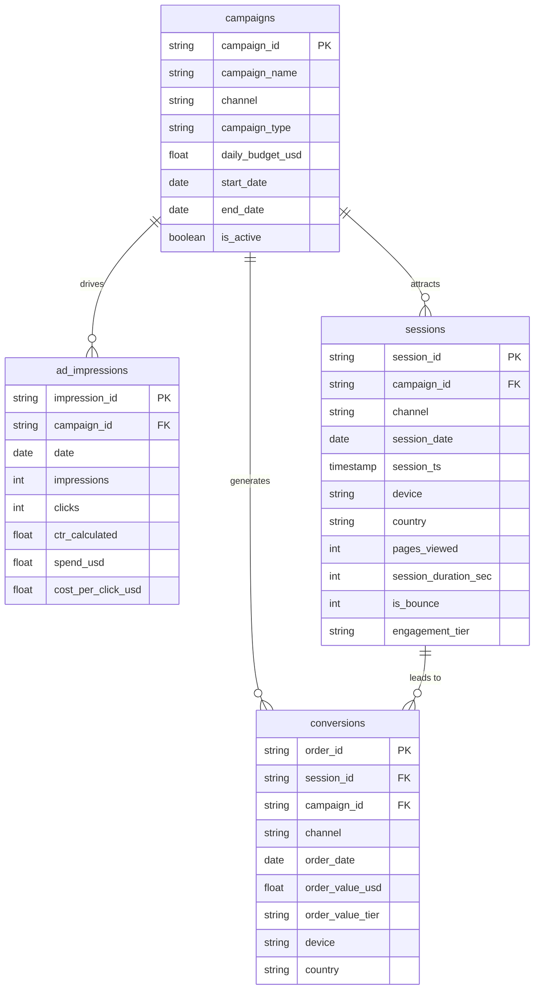

[](README.md)
&nbsp;&nbsp;
[](README.zh-CN.md)


# 流量來源與廣告 ROI 分析

**Python · Google BigQuery · SQL · Power BI**

---

## 專案概述

本專案分析五大流量渠道（Google Ads、Facebook Ads、Email、Organic、Direct）的廣告效益與投資報酬率（ROI）。透過 Python（Faker）生成 2024 全年模擬資料，載入 **Google BigQuery** 進行 ETL 清洗與多維分析，並以 **Power BI** 呈現三頁互動式儀表板。

目標是透過結構化資料建模與視覺化分析，為**渠道預算分配、廣告活動優化及 ROI 提升策略**提供數據支援。

### 涵蓋範疇

- 使用 **Python（pandas、NumPy、Faker）** 生成可重現的模擬資料（seed=42）
- 在 **BigQuery** 執行完整 ETL 清洗流程（NULL 檢查、去重、欄位標準化、衍生欄位）
- 建立星型綱要資料模型（campaigns → ad_impressions / sessions / conversions）
- 建立 5 組分析 SQL Views（流量分析、CTR vs CVR、ROI 排名）
- 在 **Power BI** 中建立 3 頁互動式儀表板
- 業務洞察與可行建議

---


## 資料集

| 項目 | 說明 |
|---|---|
| 來源 | Python 模擬生成（`random.seed(42)`，結果可完全重現） |
| 資料筆數 | campaigns: 12 rows / ad_impressions: 3,720 rows / sessions: 511,797 rows / conversions: 18,288 rows |
| 時間範圍 | 2024 年全年（2024-01-01 至 2024-12-31） |
| 涵蓋渠道 | Google Ads、Facebook Ads、Email、Organic、Direct（共 12 支 Campaign） |
| 主要欄位 | campaign_id、channel、campaign_type、daily_budget、impressions、clicks、CTR、spend_usd、session_id、device、country、order_value_usd |

---
## 為什麼使用模擬數據？

真實的廣告投放數據——包括投放費用、曝光次數、點擊與轉化事件——在大多數企業中屬於高度商業機密，受到嚴格的保密限制。目前公開可用的廣告數據集，要麼經過高度彙總（缺乏 session 或轉化的行級明細）、要麼受平台限制（需要 Facebook Ads Manager 或 Google Ads API 存取權限），要麼僅涵蓋單一渠道，無法支援跨渠道比較分析。

本項目選擇使用 Python 生成模擬數據，原因如下：

- **完整管線控制**：模擬數據讓整個項目得以覆蓋完整的數據分析流程——從原始事件生成、ETL 清洗、數據建模、SQL Views 到 Dashboard 可視化——不受公開數據集字段限制的制約。
- **貼近真實業務場景**：各項基準參數（CTR、CVR、平均訂單金額、季節性係數）均以業界公開的數字行銷基準為依據（例如：Google Ads 行業平均 CTR 4–6%；電郵行銷 CVR 3–6%；Q4 季節性升幅 +20–30%）。模擬數據的分佈規律與真實市場高度吻合，包括 Email 低成本高 ROAS 的特性，以及 Display 廣告 CPA 偏高的典型表現。
- **可重現性與可稽核性**：使用 `random.seed(42)` 確保任何分析人員均可重新生成完全相同的數據集，並驗證所有 SQL 輸出結果——這是供技術面試官審閱的 Portfolio 項目所必須具備的條件。
- **跨渠道可比性**：在五個渠道（Google Ads、Facebook Ads、Email、Organic、Direct）中以一致的 Schema 構建數據，使跨渠道 ROI 比較分析成為可能；而這種分析在真實的碎片化數據源中極難完整實現。

> **說明：** 所有模擬參數（CTR、CVR、訂單金額、Q4 季節性係數）已記錄於 [模擬參數](#資料模擬參數) 一節，並完整收錄於 [`docs/data_dictionary.zh-TW.md`](./docs/data_dictionary.zh-TW.md)。所有分析結論均在本模擬情境的框架內作出解讀。


---

## 工具與技術

| 工具 | 用途 |
|---|---|
| Python（pandas、NumPy、Faker） | 模擬資料生成與 BigQuery 上傳 |
| Google BigQuery（Standard SQL） | 資料倉儲、ETL 清洗、分析 Views |
| Power BI | 互動式儀表板與 KPI 視覺化 |
| GitHub | 版本控制與文件記錄 |

---

## 一、資料生成與清理

### 資料生成（`01_generate_data.py`）

- 以 `random.seed(42)` 確保可重現性
- 生成 4 張原始表：`campaigns`、`ad_impressions`、`sessions`、`conversions`
- 依渠道設定基準 CTR / CVR / 平均客單價，並加入季節性乘數（Q4 +30%）
- 付費渠道（Google Ads、Facebook Ads、Email）生成曝光、點擊、花費；Organic / Direct 僅生成 Session

### ETL 清洗（`01_data_cleaning.sql` — BigQuery Standard SQL）

**Step 1 — 資料驗證檢查**

| 檢查項目 | 說明 |
|---|---|
| NULL / 空白主鍵 | 對 4 張表的 PK 欄位進行 NULL 及空白檢查 |
| 重複主鍵 | GROUP BY PK HAVING COUNT > 1，確保唯一性 |
| 參照完整性 | 驗證 ad_impressions、sessions、conversions 的 campaign_id 均存在於 campaigns 表 |
| 數值範圍 | 檢查負數 impressions/clicks/spend、CTR 超出 [0,1]、無效 bounce flag |
| 日期邏輯 | 確認 end_date ≥ start_date |

**Step 2 — 清理與標準化 → 寫入 `traffic_ad_roi_clean.*`**

| 清理操作 | 說明 |
|---|---|
| 去重 | `ROW_NUMBER() OVER (PARTITION BY pk)` 保留最新記錄 |
| 渠道標準化 | CASE UPPER(TRIM(channel))，統一大小寫格式（如 "GOOGLE" → "Google Ads"） |
| 數值修正 | `GREATEST(COALESCE(value, 0), 0)` 將 NULL 補 0 並修正負值 |
| CTR 重算 | 從原始 clicks/impressions 重新計算，比儲存值更可靠 |
| 衍生欄位 — engagement_tier | 依 session 時長與瀏覽頁數分為 High / Medium / Low |
| 衍生欄位 — order_value_tier | 依訂單金額分為 High Value（≥$500）/ Mid Value（≥$100）/ Low Value |
| 無效訂單過濾 | 移除 order_value_usd ≤ 0 的轉換紀錄 |

---

## 二、資料模型（BigQuery — 星型綱要）

本專案以 `campaigns` 為中央維度表，`ad_impressions`、`sessions`、`conversions` 為事實表，構建清晰的星型綱要。

### 綱要圖



### 資料表說明

| 表格 | 說明 | 設計重點 |
|---|---|---|
| `campaigns` | 12 支廣告活動主檔 | 涵蓋渠道、類型、每日預算、投放期間；衍生 `is_active` 欄位 |
| `ad_impressions` | 付費渠道每日曝光與點擊（3,720 rows） | 從原始數值重新計算 CTR；衍生 `cost_per_click_usd` |
| `sessions` | 網站 Session 瀏覽紀錄（511,797 rows） | 含裝置、國家、互動深度；衍生 `engagement_tier` |
| `conversions` | 訂單轉換事件（18,288 rows） | 雙向 FK（session + campaign）；衍生 `order_value_tier`；移除無效訂單 |

---

## 三、SQL 分析

### 分析 Views 架構

| SQL 檔案 | 建立的 Views | 說明 |
|---|---|---|
| `01_data_cleaning.sql` | `traffic_ad_roi_clean.*`（4 tables） | NULL 檢查、去重、欄位標準化、engagement_tier、order_value_tier |
| `02_traffic_analysis.sql` | `v_channel_performance`、`v_monthly_channel_trend`、`v_device_channel_conversion` | 各渠道整體表現、月度趨勢、裝置轉換分布 |
| `03_ctr_conversion.sql` | `v_campaign_daily_ctr_cvr`、`v_ctr_bucket_analysis`、`v_campaign_ctr_cvr_scatter` | CTR vs CVR 日級別、分桶分析、散點圖資料 |
| `04_roi_analysis.sql` | `v_campaign_roi`、`v_monthly_roi_trend`、`v_campaign_type_roi` | Campaign ROI 排名、月度 ROI 趨勢、Campaign Type 比較 |
| `05_dim_channel.sql` | `dim_channel`、`dim_campaign_type` | 渠道 & Campaign Type 維度表（含排序） |

### 主要商業問題

**哪些流量渠道帶來最多訂單與最高收益？**

```sql
SELECT
    channel,
    COUNT(order_id)               AS total_orders,
    ROUND(SUM(order_value_usd),0) AS total_revenue_usd,
    ROUND(AVG(order_value_usd),2) AS avg_order_value
FROM `traffic_ad_roi_clean.conversions`
GROUP BY channel
ORDER BY total_revenue_usd DESC;
```

**各 Campaign 的 ROAS 與淨 ROI 排名（付費渠道）？**

```sql
SELECT
    c.campaign_id,
    c.campaign_name,
    c.channel,
    ROUND(SUM(i.spend_usd), 0)                                    AS total_spend,
    ROUND(SUM(v.order_value_usd), 0)                              AS total_revenue,
    ROUND(SAFE_DIVIDE(SUM(v.order_value_usd), SUM(i.spend_usd)), 2) AS roas,
    ROUND(SAFE_DIVIDE(SUM(v.order_value_usd) - SUM(i.spend_usd),
                      SUM(i.spend_usd)) * 100, 1)                 AS roi_pct
FROM `traffic_ad_roi_clean.campaigns`      c
JOIN `traffic_ad_roi_clean.ad_impressions` i ON i.campaign_id = c.campaign_id
JOIN `traffic_ad_roi_clean.conversions`    v ON v.campaign_id = c.campaign_id
WHERE c.channel NOT IN ('Organic', 'Direct')
GROUP BY 1, 2, 3
ORDER BY roas DESC;
```

**CTR 分桶分析 — 高 CTR 是否真的帶來更高 CVR？**

```sql
SELECT
    CASE
        WHEN ctr_calculated < 0.01 THEN '< 1%'
        WHEN ctr_calculated < 0.02 THEN '1–2%'
        WHEN ctr_calculated < 0.03 THEN '2–3%'
        WHEN ctr_calculated < 0.04 THEN '3–4%'
        WHEN ctr_calculated < 0.05 THEN '4–5%'
        ELSE '≥ 5%'
    END                                          AS ctr_bucket,
    COUNT(DISTINCT i.impression_id)              AS campaign_days,
    ROUND(AVG(i.ctr_calculated) * 100, 2)        AS avg_ctr_pct,
    ROUND(SAFE_DIVIDE(
        COUNT(v.order_id),
        COUNT(DISTINCT s.session_id)
    ) * 100, 2)                                  AS cvr_pct
FROM `traffic_ad_roi_clean.ad_impressions` i
LEFT JOIN `traffic_ad_roi_clean.sessions`    s ON s.campaign_id = i.campaign_id
                                               AND s.session_date = i.date
LEFT JOIN `traffic_ad_roi_clean.conversions` v ON v.session_id = s.session_id
GROUP BY ctr_bucket
ORDER BY avg_ctr_pct;
```

---

## 四、Power BI 儀表板（3 頁）

### 第 1 頁：Channel Overview（渠道總覽）


- **KPI 卡片**：總訂單數（18,288）、總收益（$1,754,574）、總廣告花費、整體 ROAS
- **渠道訂單排名**：Google Ads（11,732）領先，Email 以最低花費貢獻 6.6% 訂單
- **收益 vs 花費橫條圖**：各渠道收益與支出對比，直觀呈現 ROI 差距
- **月度趨勢折線圖**：2024 年全年各渠道訂單走勢，Q4 明顯旺季效應
- **裝置 Donut 圖**：Desktop / Mobile / Tablet 轉換占比分布

### 第 2 頁：CTR vs Conversion（點擊率 vs 轉換率）


- **CTR × CVR 散點圖**：以 Campaign 為單位，氣泡大小代表訂單量，揭示「高 CTR ≠ 高 CVR」
- **Campaign 詳細表格**：列出各 Campaign 的 CTR、CVR、訂單數、平均客單價
- **每日 CTR & CVR 折線柱狀圖**：日級別趨勢，觀察 Campaign 投放期間的效益波動

### 第 3 頁：ROI Analysis（ROI 分析）


- **Campaign ROI 排名橫條圖**：Email_Abandoned_Cart（ROAS 45.12x）至 Google_Display_Remarketing（ROAS 0.70x）
- **ROAS vs Spend 散點圖**：花費越多不等於 ROAS 越高，Email 以極低花費創最高報酬
- **Campaign Type 矩陣**：Automation > Newsletter > Promotion > Search > Shopping > Display
- **月度 ROI 趨勢**：各類型 Campaign ROI 全年走勢對比

Dashboard PDF 匯出：[`powerbi/dashboard.pdf`](./powerbi/dashboard.pdf)  


---

## 主要發現

### 渠道效益

| 渠道 | 訂單數 | 總收益 (USD) | CVR | ROAS |
|------|--------|-------------|-----|------|
| Google Ads | 11,732 | $1,118,727 | 3.54% | 2.15x |
| Facebook Ads | 2,797 | $246,650 | 2.65% | 1.38x |
| Direct | 1,979 | $215,525 | 6.83% | N/A |
| Email | 1,215 | $125,891 | **7.43%** | **30.8x** |
| Organic | 565 | $47,781 | 1.93% | N/A |

### Campaign ROI 排名（付費渠道）

| 排名 | Campaign | ROAS | ROI% | CPA (USD) |
|------|---------|------|------|-----------| 
| 🥇 1 | Email_Abandoned_Cart | 45.12x | 4,412% | $2.27 |
| 🥈 2 | Email_Newsletter_Monthly | 27.86x | 2,686% | $3.74 |
| 🥉 3 | Email_Promo_Flash_Sale | 26.95x | 2,595% | $3.85 |
| 4 | Google_Shopping_Q1 | 3.54x | 254% | $26.98 |
| 5 | Facebook_Retargeting | 2.63x | 163% | $33.77 |
| ... | ... | ... | ... | ... |
| 🚨 Last | Google_Display_Remarketing | 0.70x | **-30%** | $132.36 |

### CTR vs CVR 洞察

在 Email 渠道篩選下，CTR 3–4% 區間的 CVR 最高（5.22%），而 CTR ≥ 5% 的 CVR 反而最低（3.47%）。**高 CTR ≠ 高 CVR**，廣告吸引力與購買意圖需分開評估。

---

## 業務建議

1. **擴大 Email Automation 投入** — Email_Abandoned_Cart（ROAS 45.12x、CPA $2.27）是全渠道中最高效的 Campaign，應優先加大觸發頻率與受眾覆蓋
2. **暫停或重組 Google Display Remarketing** — ROAS 僅 0.70x，為唯一負 ROI Campaign（-30%），每次獲客成本高達 $132；建議暫停並重新審視受眾分組與出價策略
3. **以 ROAS / CPA 取代純 CTR 作為優化指標** — 分析顯示高 CTR 不等於高 CVR；應將優化重心從點擊率轉移至轉換率與每訂單成本
4. **Google Ads 集中預算至 Search 與 Shopping** — Google_Brand_Search 和 Google_Shopping_Q1 的 ROAS 分別達 3x+ 及 3.5x；相比之下 Display 效益遠遜，預算應向高效類型傾斜
5. **利用 Q4 旺季效應提前規劃促銷 Campaign** — 月度趨勢顯示 10–12 月轉換量顯著上升；建議於 9 月底前完成 Email 自動化序列與 Google Shopping 廣告素材更新

---

## 專案結構
```
03_Traffic_Sources_Ad_ROI_Analysis/
├── README.md
├── data/
│ ├── bigquery_cache_limit50/ # BigQuery Views 快取（前 50 筆，供離線參考）
│ └── .gitkeep # 原始 CSV（gitignore，不上傳大檔）
├── scripts/
│ ├── 01_generate_data.py # 模擬資料生成（seed=42，可重現）
│ └── 02_upload_to_bigquery.py # BigQuery 上傳（traffic_ad_roi dataset）
├── sql/
│ ├── 01_data_cleaning.sql # ETL 清洗 & 驗證
│ ├── 02_traffic_analysis.sql # 流量來源分析
│ ├── 03_ctr_conversion.sql # CTR vs 轉換率分析
│ ├── 04_roi_analysis.sql # ROI & ROAS 分析
│ ├── 05_dim_channel.sql # 維度表（channel & campaign type）
│ └── screenshots/ # SQL 執行結果截圖
├── powerbi/
│ ├── dashboard.pdf # Dashboard PDF 匯出
│ ├── dashboard_design.md # Power BI 設計文件（視覺化規格 & DAX）
│ ├── background.png # Dashboard 背景圖
│ └── screenshots/ # Dashboard 截圖
├── docs/
│ └── data_dictionary.md # 資料字典（欄位說明、指標定義、Simulation Parameters）
├── error_reports/ # ETL 錯誤報告
└── log.ipynb # 開發日誌 Notebook
```

---

## 如何重現本專案

**前置需求**：Python 3.8+、Google Cloud 帳號（BigQuery 啟用）、Power BI Desktop

1. 安裝依賴套件
   ```bash
   pip install pandas numpy faker google-cloud-bigquery pyarrow
   ```
2. 生成模擬資料
   ```bash
   python scripts/01_generate_data.py
   # 輸出：data/campaigns.csv, ad_impressions.csv, sessions.csv, conversions.csv
   ```
3. 上傳資料至 BigQuery
   ```bash
   python scripts/02_upload_to_bigquery.py
   # 目標：{project}.traffic_ad_roi.*
   ```
4. 依序在 BigQuery 執行 SQL 腳本（01 → 05）
5. 在 Power BI Desktop 開啟 `.pbix`，透過 BigQuery Views 連接資料

---

## 資料模擬參數

| 渠道 | 基準 CTR | 基準 CVR | 平均客單價 |
|------|---------|---------|----------|
| Google Ads | 4.5% | 3.5% | $95 |
| Facebook Ads | 2.2% | 2.5% | $88 |
| Email | 2.8% | 5.5% | $102 |
| Organic | N/A | 3.0% | $85 |
| Direct | N/A | 4.5% | $110 |

> 資料以 `random.seed(42)` 固定，結果可完全重現。詳細欄位說明見 [`docs/data_dictionary.zh-TW.md`](./docs/data_dictionary.zh-TW.md)。

---

## 作者

Ross Tang | [GitHub](https://github.com/ross-bi)

## 授權條款

本專案採用 [MIT License](./LICENSE) 授權。
