# Power BI Dashboard Design
## Traffic Sources & Ad ROI Analysis

---

## 1. Connect to BigQuery

1. Power BI Desktop → **Get Data → Google BigQuery**
2. Project: `your-gcp-project-id`
3. Dataset: `traffic_ad_roi_clean`
4. Load the following **Views** (do not load the raw tables directly):

**Analytical Views:**
- `v_channel_performance`
- `v_monthly_channel_trend`
- `v_device_channel_conversion`
- `v_campaign_daily_ctr_cvr`
- `v_ctr_bucket_analysis`
- `v_campaign_ctr_cvr_scatter`
- `v_campaign_roi`
- `v_monthly_roi_trend`
- `v_campaign_type_roi`

**Dimension Tables:**
- `dim_channel`
- `dim_campaign_type`

---

## 2. Relationship Configuration

In the Power BI Model view, manually create the following relationships to link the 9 Views to the 2 dimension tables:

| From Table | From Column | To Table | To Column | Cardinality |
|------------|------------|----------|-----------|-------------|
| `v_channel_performance` | `channel` | `dim_channel` | `channel` | Many-to-One |
| `v_channel_performance` | `dim_campaign_type` | `dim_channel` | `campaign_type` | Many-to-One |
| `v_campaign_roi` | `channel` | `dim_channel` | `channel` | Many-to-One |
| `v_campaign_roi` | `campaign_type` | `dim_campaign_type` | `campaign_type` | Many-to-One |
| ... | ... | ... | ... | ... |

> The `sort_order` field in the dimension tables is used to control the display order of channels in charts.

```mermaid
erDiagram

    dim_channel {
        string channel PK
        int sort_order
    }

    dim_campaign_type {
        string campaign_type PK
        int sort_order
    }

    v_channel_performance {
        string channel FK
        string campaign_type FK
        int total_sessions
        int total_orders
        float total_revenue_usd
        float total_spend_usd
        float conversion_rate
        float cost_per_acquisition
        float roas
    }

    v_monthly_channel_trend {
        string year_month
        string channel FK
        int orders
        float revenue_usd
    }

    v_device_channel_conversion {
        string channel FK
        string device
        int orders
        float revenue_usd
    }

    v_campaign_daily_ctr_cvr {
        string campaign_id
        string campaign_name
        string channel FK
        string campaign_type FK
        date date
        float ctr
        float session_cvr
        int orders
        float revenue_usd
    }

    v_ctr_bucket_analysis {
        string channel FK
        string campaign_type FK
        string ctr_bucket
        float avg_ctr
        float avg_session_cvr
        int total_orders
        float total_revenue_usd
    }

    v_campaign_ctr_cvr_scatter {
        string campaign_id PK
        string campaign_name
        string channel FK
        string campaign_type FK
        float avg_ctr
        float avg_session_cvr
        int total_orders
        float total_revenue_usd
        float total_spend_usd
    }

    v_campaign_roi {
        string campaign_id PK
        string campaign_name
        string channel FK
        string campaign_type FK
        float total_spend_usd
        float total_revenue_usd
        int total_orders
        float ctr
        float session_cvr
        float roas
        float roi
        float cost_per_acquisition
        float cpm_usd
        float cpc_usd
    }

    v_monthly_roi_trend {
        string year_month
        string channel FK
        string campaign_type FK
        float spend_usd
        float revenue_usd
        float roas
        float roi
    }

    v_campaign_type_roi {
        string channel FK
        string campaign_type FK
        int campaign_count
        float total_spend_usd
        float total_revenue_usd
        float avg_ctr
        float avg_cvr
        float avg_roas
        float avg_roi
        float avg_cpa_usd
    }

    dim_channel ||--o{ v_channel_performance : "channel"
    dim_channel ||--o{ v_monthly_channel_trend : "channel"
    dim_channel ||--o{ v_device_channel_conversion : "channel"
    dim_channel ||--o{ v_campaign_daily_ctr_cvr : "channel"
    dim_channel ||--o{ v_ctr_bucket_analysis : "channel"
    dim_channel ||--o{ v_campaign_ctr_cvr_scatter : "channel"
    dim_channel ||--o{ v_campaign_roi : "channel"
    dim_channel ||--o{ v_monthly_roi_trend : "channel"
    dim_channel ||--o{ v_campaign_type_roi : "channel"

    dim_campaign_type ||--o{ v_channel_performance : "campaign_type"
    dim_campaign_type ||--o{ v_campaign_daily_ctr_cvr : "campaign_type"
    dim_campaign_type ||--o{ v_ctr_bucket_analysis : "campaign_type"
    dim_campaign_type ||--o{ v_campaign_ctr_cvr_scatter : "campaign_type"
    dim_campaign_type ||--o{ v_campaign_roi : "campaign_type"
    dim_campaign_type ||--o{ v_monthly_roi_trend : "campaign_type"
    dim_campaign_type ||--o{ v_campaign_type_roi : "campaign_type"

```



---

## 3. Report Structure (3 Report Pages)

### Page 1 — Channel Overview

**Goal**: Quickly see which channels are most valuable.

| Section | Visual Type | Data Source | Fields |
|--------|-------------|-------------|--------|
| KPI Cards (top) | Card × 5 | `v_channel_performance` | `total_orders`, `total_revenue_usd`, `total_spend_usd`, `conversion_rate`, `bounce_rate` |
| Channel order ranking | Clustered Bar | `v_channel_performance` | `channel` vs `total_orders` |
| Channel revenue vs spend | Clustered Column | `v_channel_performance` | `channel` vs `total_revenue_usd` + `total_spend_usd` |
| ROAS bar | Bar Chart | `v_channel_performance` | `channel` vs `roas` (filter `total_spend_usd > 0`) |
| Monthly trend line chart | Line Chart | `v_monthly_channel_trend` | `year_month` vs `revenue_usd`, `channel` as Legend |
| Device distribution | Donut | `v_device_channel_conversion` | `device` vs `orders` |

**Slicers**: `channel`

---

### Page 2 — CTR vs Conversion

**Goal**: Validate the relationship between CTR and conversion rate.

| Section | Visual Type | Data Source | Fields |
|--------|-------------|-------------|--------|
| CTR × CVR scatter plot | Scatter Chart | `v_campaign_ctr_cvr_scatter` | X = `avg_ctr`, Y = `avg_session_cvr`, Size = `total_orders`, Color = `channel` |
| Campaign detail table | Table | `v_campaign_ctr_cvr_scatter` | `campaign_name`, `channel`, `campaign_type`, `avg_ctr`, `avg_session_cvr`, `total_orders`, `total_revenue_usd` |
| Daily CTR & CVR combo chart | Line and Clustered Column | `v_campaign_daily_ctr_cvr` | X = `date`, Columns = `clicks`, Lines = `ctr`, `session_cvr` |
| CTR bucket combo chart | Line and Clustered Column | `v_ctr_bucket_analysis` | X = `ctr_bucket`, Columns = `total_revenue_usd`, Line = `avg_session_cvr` |

**Slicers**: `channel`, `campaign_type`

**DAX Measures:**

```dax
Correlation Label = 
VAR avgCTR = AVERAGE(v_campaign_ctr_cvr_scatter[avg_ctr]) * 100
VAR avgCVR = AVERAGE(v_campaign_ctr_cvr_scatter[avg_session_cvr]) * 100
RETURN
    "Avg CTR: " & FORMAT(avgCTR, "0.00") &
    "% | Avg CVR: " & FORMAT(avgCVR, "0.00") & "%"
```

---

### Page 3 — ROI Analysis

**Goal**: Identify the most efficient campaigns.

| Section | Visual Type | Data Source | Fields |
|--------|-------------|-------------|--------|
| KPI Cards | Card × 4 | `v_campaign_roi` | DAX: Best ROAS Campaign, Avg ROI%, Total Revenue, Total Spend |
| Campaign ROI ranking | Horizontal Bar | `v_campaign_roi` | `campaign_name` vs `roi` (conditional formatting: negatives in red) |
| ROAS vs Spend scatter | Scatter | `v_campaign_roi` | X = `total_spend_usd`, Y = `roas`, Size = `total_orders`, Color = `channel` |
| Campaign Type comparison matrix | Matrix | `v_campaign_type_roi` | Rows = `channel`, Columns = `campaign_type`, Values = `avg_roas`, `avg_cpa_usd` |
| Monthly ROI trend | Line Chart | `v_monthly_roi_trend` | X = `year_month`, Y = `roi`, Legend = `channel` |
| CPA comparison | Bar Chart | `v_campaign_roi` | `campaign_name` vs `cost_per_acquisition` (sorted ascending) |

**Slicers**: `channel`, `campaign_type`

**DAX Measures:**

```dax
Best ROAS Campaign =
VAR maxRoas =
    MAXX(ALL(v_campaign_roi), v_campaign_roi[roas])
RETURN
    CALCULATE(
        FIRSTNONBLANK(v_campaign_roi[campaign_name], 1),
        v_campaign_roi[roas] = maxRoas
    )

ROAS Display =
VAR r = SELECTEDVALUE(v_campaign_roi[roas])
RETURN
    IF(
        ISBLANK(r) || SELECTEDVALUE(v_campaign_roi[total_spend_usd]) = 0,
        "N/A (No Spend)",
        FORMAT(r, "0.00") & "x"
    )

ROI Traffic Light =
VAR r = SELECTEDVALUE(v_campaign_roi[roi])
RETURN
    IF(
        r >= 1, "🟢 High",
        IF(r >= 0, "🟡 Positive", "🔴 Negative")
    )
```

---

## 4. Number Formatting Settings

| Field Type | Format String | Example |
|-----------|---------------|---------|
| Currency (USD) | `$#,##0` | $1,118,727 |
| Currency with decimals | `$#,##0.00` | $97.50 |
| Percentage | `0.00%` | 3.54% |
| Multiplier (ROAS) | `0.00"x"` | 45.12x |
| Integer count | `#,##0` | 18,288 |
| Month | `MMM YYYY` | Jan 2024 |

---

## 5. Design Guidelines

### Channel Color Palette

| Channel | Color Code |
|---------|-----------|
| Google Ads | `#4285F4` |
| Facebook Ads | `#0D47A1` (dark blue, to avoid confusion with Google) |
| Email | `#FF6D00` |
| Organic | `#2E7D32` |
| Direct | `#6A1B9A` |

### Global Settings

- Background color: `#F8F9FA` (light grey-white)
- Title font: Segoe UI Semibold 18px
- Numeric font: Segoe UI 14px
- KPI Cards: large number + descriptive subtitle
- All currency fields: USD `$` with thousands separator
- All percentage fields: `0.00%` format

### Conditional Formatting Rules

| Condition | Format |
|----------|--------|
| `roi < 0` | Red background |
| `roi` between 0–1 | Yellow background |
| `roi > 1` | Green background |
| `roas < 1` | Red font |
| Highest `cost_per_acquisition` | Red highlight |
| Lowest `cost_per_acquisition` | Green highlight |