# Power BI 仪表板设计文件
## Traffic Sources & Ad ROI Analysis

---

## 一、连接 BigQuery

1. Power BI Desktop → **Get Data → Google BigQuery**
2. Project：`your-gcp-project-id`
3. Dataset：`traffic_ad_roi_clean`
4. 加载以下 **Views**（请勿直接加载原始数据表）：

**分析 Views：**
- `v_channel_performance`
- `v_monthly_channel_trend`
- `v_device_channel_conversion`
- `v_campaign_daily_ctr_cvr`
- `v_ctr_bucket_analysis`
- `v_campaign_ctr_cvr_scatter`
- `v_campaign_roi`
- `v_monthly_roi_trend`
- `v_campaign_type_roi`

**维度表：**
- `dim_channel`
- `dim_campaign_type`

---

## 二、数据关联设定（Relationships）

在 Power BI Model 检视中手动建立以下关联, 把9张view 分别连上2张维度表：

| From Table | From Column | To Table | To Column | Cardinality |
|------------|------------|----------|-----------|-------------|
| `v_channel_performance` | `channel` | `dim_channel` | `channel` | Many-to-One |
| `v_channel_performance` | `dim_campaign_type` | `dim_channel` | `campaign_type` | Many-to-One |
| `v_campaign_roi` | `channel` | `dim_channel` | `channel` | Many-to-One |
| `v_campaign_roi` | `campaign_type` | `dim_campaign_type` | `campaign_type` | Many-to-One |
| ... | ... | ... | ... | ... |

> 维度表的 `sort_order` 字段用于控制图表中渠道的显示排序。

```mermaid
erDiagram

    dim_channel {
        string channel PK
        int sort_order
    }

    dim_campaign_type {
        string campaign_type PK
        int sort_order
    }

    v_channel_performance {
        string channel FK
        string campaign_type FK
        int total_sessions
        int total_orders
        float total_revenue_usd
        float total_spend_usd
        float conversion_rate
        float cost_per_acquisition
        float roas
    }

    v_monthly_channel_trend {
        string year_month
        string channel FK
        int orders
        float revenue_usd
    }

    v_device_channel_conversion {
        string channel FK
        string device
        int orders
        float revenue_usd
    }

    v_campaign_daily_ctr_cvr {
        string campaign_id
        string campaign_name
        string channel FK
        string campaign_type FK
        date date
        float ctr
        float session_cvr
        int orders
        float revenue_usd
    }

    v_ctr_bucket_analysis {
        string channel FK
        string campaign_type FK
        string ctr_bucket
        float avg_ctr
        float avg_session_cvr
        int total_orders
        float total_revenue_usd
    }

    v_campaign_ctr_cvr_scatter {
        string campaign_id PK
        string campaign_name
        string channel FK
        string campaign_type FK
        float avg_ctr
        float avg_session_cvr
        int total_orders
        float total_revenue_usd
        float total_spend_usd
    }

    v_campaign_roi {
        string campaign_id PK
        string campaign_name
        string channel FK
        string campaign_type FK
        float total_spend_usd
        float total_revenue_usd
        int total_orders
        float ctr
        float session_cvr
        float roas
        float roi
        float cost_per_acquisition
        float cpm_usd
        float cpc_usd
    }

    v_monthly_roi_trend {
        string year_month
        string channel FK
        string campaign_type FK
        float spend_usd
        float revenue_usd
        float roas
        float roi
    }

    v_campaign_type_roi {
        string channel FK
        string campaign_type FK
        int campaign_count
        float total_spend_usd
        float total_revenue_usd
        float avg_ctr
        float avg_cvr
        float avg_roas
        float avg_roi
        float avg_cpa_usd
    }

    dim_channel ||--o{ v_channel_performance : "channel"
    dim_channel ||--o{ v_monthly_channel_trend : "channel"
    dim_channel ||--o{ v_device_channel_conversion : "channel"
    dim_channel ||--o{ v_campaign_daily_ctr_cvr : "channel"
    dim_channel ||--o{ v_ctr_bucket_analysis : "channel"
    dim_channel ||--o{ v_campaign_ctr_cvr_scatter : "channel"
    dim_channel ||--o{ v_campaign_roi : "channel"
    dim_channel ||--o{ v_monthly_roi_trend : "channel"
    dim_channel ||--o{ v_campaign_type_roi : "channel"

    dim_campaign_type ||--o{ v_channel_performance : "campaign_type"
    dim_campaign_type ||--o{ v_campaign_daily_ctr_cvr : "campaign_type"
    dim_campaign_type ||--o{ v_ctr_bucket_analysis : "campaign_type"
    dim_campaign_type ||--o{ v_campaign_ctr_cvr_scatter : "campaign_type"
    dim_campaign_type ||--o{ v_campaign_roi : "campaign_type"
    dim_campaign_type ||--o{ v_monthly_roi_trend : "campaign_type"
    dim_campaign_type ||--o{ v_campaign_type_roi : "campaign_type"

```


---

## 三、仪表板结构（3 个 Report Pages）

### Page 1 — Channel Overview（流量来源总览）

**目标**：一眼看出哪个渠道最有价值

| 区块 | 可视化类型 | 数据源 | 字段 |
|------|-----------|---------|------|
| KPI Cards（顶部）| Card × 5 | `v_channel_performance` | `total_orders`、`total_revenue_usd`、`total_spend_usd`、`conversion_rate`、`bounce_rate` |
| 渠道订单排名 | Clustered Bar | `v_channel_performance` | `channel` vs `total_orders` |
| 渠道收益 vs 支出 | Clustered Column | `v_channel_performance` | `channel` vs `total_revenue_usd` + `total_spend_usd` |
| ROAS 条形图 | Bar Chart | `v_channel_performance` | `channel` vs `roas`（过滤 `total_spend_usd > 0`）|
| 月度趋势折线图 | Line Chart | `v_monthly_channel_trend` | `year_month` vs `revenue_usd`，`channel` 为 Legend |
| 装置分布 | Donut | `v_device_channel_conversion` | `device` vs `orders` |

**Slicers**：`channel`

---

### Page 2 — CTR vs Conversion（点击率与转换分析）

**目标**：验证 CTR 与转换率的相关性

| 区块 | 可视化类型 | 数据源 | 字段 |
|------|-----------|---------|------|
| CTR × CVR 散点图 | Scatter Chart | `v_campaign_ctr_cvr_scatter` | X=`avg_ctr`，Y=`avg_session_cvr`，Size=`total_orders`，Color=`channel` |
| Campaign 详细表格 | Table | `v_campaign_ctr_cvr_scatter` | `campaign_name`、`channel`、`campaign_type`、`avg_ctr`、`avg_session_cvr`、`total_orders`、`total_revenue_usd` |
| 每日 CTR & CVR 折线柱状图 | Line and Clustered Column | `v_campaign_daily_ctr_cvr` | X=`date`，柱=`clicks`，线1=`ctr`，线2=`session_cvr` |
| CTR Bucket 折线柱状图 | Line and Clustered Column | `v_ctr_bucket_analysis` | X=`ctr_bucket`，柱=`total_revenue_usd`，线=`avg_session_cvr` |

**Slicers**：`channel`、`campaign_type`

**DAX Measures：**

```dax
Correlation Label = 
VAR avgCTR = AVERAGE(v_campaign_ctr_cvr_scatter[avg_ctr]) * 100
VAR avgCVR = AVERAGE(v_campaign_ctr_cvr_scatter[avg_session_cvr]) * 100
RETURN "Avg CTR: " & FORMAT(avgCTR, "0.00") & "% | Avg CVR: " & FORMAT(avgCVR, "0.00") & "%"
```

---

### Page 3 — ROI Analysis（广告投资报酬分析）

**目标**：找出最高效的广告活动

| 区块 | 可视化类型 | 数据源 | 字段 |
|------|-----------|---------|------|
| KPI Cards | Card × 4 | `v_campaign_roi` | DAX: Best ROAS Campaign、Avg ROI%、Total Revenue、Total Spend |
| Campaign ROI 排名 | Horizontal Bar | `v_campaign_roi` | `campaign_name` vs `roi`（条件格式：负值红色）|
| ROAS vs Spend 散点图 | Scatter | `v_campaign_roi` | X=`total_spend_usd`，Y=`roas`，Size=`total_orders`，Color=`channel` |
| Campaign Type 比较矩阵 | Matrix | `v_campaign_type_roi` | Row=`channel`，Column=`campaign_type`，Values=`avg_roas`、`avg_cpa_usd` |
| 月度 ROI 趋势 | Line Chart | `v_monthly_roi_trend` | X=`year_month`，Y=`roi`，Legend=`channel` |
| CPA 比较 | Bar Chart | `v_campaign_roi` | `campaign_name` vs `cost_per_acquisition`（由低至高排序）|

**Slicers**：`channel`、`campaign_type`

**DAX Measures：**

```dax
Best ROAS Campaign =
VAR maxRoas = MAXX(ALL(v_campaign_roi), v_campaign_roi[roas])
RETURN
    CALCULATE(
        FIRSTNONBLANK(v_campaign_roi[campaign_name], 1),
        v_campaign_roi[roas] = maxRoas
    )

ROAS Display =
VAR r = SELECTEDVALUE(v_campaign_roi[roas])
RETURN
    IF(
        ISBLANK(r) || SELECTEDVALUE(v_campaign_roi[total_spend_usd]) = 0,
        "N/A (No Spend)",
        FORMAT(r, "0.00") & "x"
    )

ROI Traffic Light =
VAR r = SELECTEDVALUE(v_campaign_roi[roi])
RETURN
    IF(r >= 1,   "🟢 High",
    IF(r >= 0,   "🟡 Positive",
                 "🔴 Negative"))

```

---

## 四、数值格式化设定

| 字段类型 | 格式字符串 | 范例 |
|---------|---------|------|
| 金额（USD） | `$#,##0` | $1,118,727 |
| 金额（小数）| `$#,##0.00` | $97.50 |
| 百分比 | `0.00%` | 3.54% |
| 倍数（ROAS）| `0.00"x"` | 45.12x |
| 整数计数 | `#,##0` | 18,288 |
| 日期（月） | `MMM YYYY` | Jan 2024 |

---

## 五、设计规范

### 渠道色彩方案

| 渠道 | 色码 |
|------|------|
| Google Ads | `#4285F4` |
| Facebook Ads | `#0D47A1`（深蓝，避免与 Google 混淆）|
| Email | `#FF6D00` |
| Organic | `#2E7D32` |
| Direct | `#6A1B9A` |

### 全局设定

- 背景色：`#F8F9FA`（浅灰白）
- 主标题字型：Segoe UI Semibold 18px
- 数值字型：Segoe UI 14px
- KPI Card：大数字 + 副标题说明文字
- 所有金额：USD `$` 格式，千分位分隔符
- 所有百分比：`0.00%` 格式

### 条件格式化规则

| 条件 | 格式 |
|------|------|
| `roi < 0` | 红色背景 |
| `roi` 介于 0–1 | 黄色背景 |
| `roi > 1` | 绿色背景 |
| `roas < 1` | 红色字体 |
| `cost_per_acquisition` 最高值 | 红色标记 |
| `cost_per_acquisition` 最低值 | 绿色标记 |

